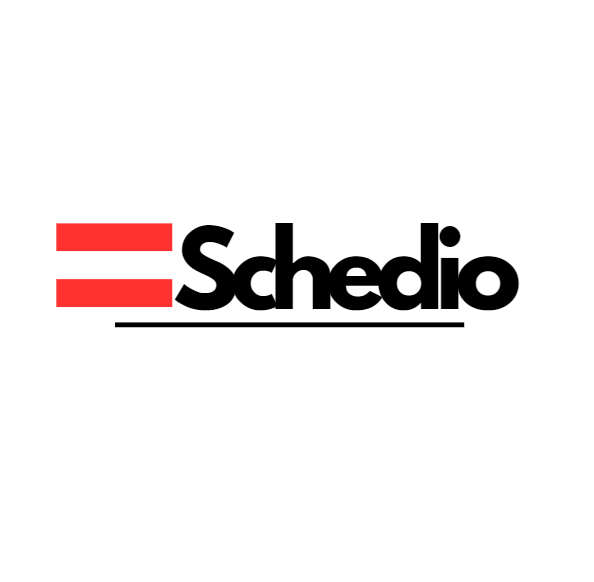

# Schedio
HackNJIT 2024

# Schedio



Schedio is an AI-powered graphic design platform that enables small business owners and entrepreneurs to create professional-quality designs through natural language inputs. By combining Adobe Express's powerful design capabilities with advanced AI, Schedio makes professional graphic design accessible to everyone, regardless of their design experience.

## 🚀 Features

- **Natural Language Design Generation**: Create designs by describing them in plain text or speech
- **AI-Powered Design Suggestions**: Receive intelligent design recommendations based on your input
- **Customizable Templates**: Access and modify professional templates for various design needs
- **Brand Identity Management**: Save and apply your brand colors, fonts, and style preferences
- **Adobe Express Integration**: Leverage professional design tools in an intuitive interface
- **Real-time Preview**: See your designs come to life as you make changes

## 🛠️ Tech Stack

- **Frontend**: React.js with TypeScript
- **UI Framework**: Custom components with CSS modules
- **Design Tools**: Adobe Express SDK
- **Infrastructure**: Cloudflare for performance and security
- **Build Tools**: Webpack
- **Package Management**: npm

## 📋 Prerequisites

- Node.js (v14 or higher)
- npm (v6 or higher)
- Adobe Express API credentials
- Cloudflare account (for deployment)

## 🔧 Installation

1. Clone the repository:
```bash
git clone https://github.com/yourusername/schedio.git
cd schedio
```

2. Install dependencies:
```bash
npm install
```

3. Create a `.env` file in the root directory and add your environment variables:
```env
ADOBE_EXPRESS_API_KEY=your_api_key
CLOUDFLARE_TOKEN=your_cloudflare_token
```

4. Start the development server:
```bash
npm run dev
```

## 📦 Project Structure

```
schedio/
├── config/               # Configuration files
├── schedio-addon/       # Adobe Express addon integration
│   ├── dist/           # Compiled addon files
│   └── src/           # Addon source files
├── src/                # Main application source
│   ├── app.js         # Application entry point
│   ├── index.html     # Main HTML template
│   ├── index.tsx      # Root React component
│   └── styles.css     # Global styles
├── package.json        # Project dependencies and scripts
├── webpack.config.js   # Webpack configuration
└── README.md          # Project documentation
```

## 🚀 Deployment

The application can be deployed using Cloudflare Pages:

1. Configure your Cloudflare account settings
2. Run the build command:
```bash
npm run build
```

3. Deploy to Cloudflare:
```bash
npm run deploy
```

## 🤝 Contributing

We welcome contributions to Schedio! Please follow these steps:

1. Fork the repository
2. Create a feature branch (`git checkout -b feature/AmazingFeature`)
3. Commit your changes (`git commit -m 'Add some AmazingFeature'`)
4. Push to the branch (`git push origin feature/AmazingFeature`)
5. Open a Pull Request

## 📝 License

This project is licensed under the MIT License - see the [LICENSE](LICENSE) file for details.

## 🙏 Acknowledgments

- Adobe Express team for their powerful design SDK
- Cloudflare for providing robust infrastructure
- All our beta testers and early adopters who provided valuable feedback

## 📧 Contact

For any questions or concerns, please open an issue in the GitHub repository or contact our team at [mohammedchowdhury@schedio.com].

---

Made with ❤️ by the Schedio Team